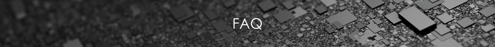

# E-Charte d'exploitation et de construction numérique

En choisissant votre profil ci-dessous, un pré-filtre d'éléments susceptibles de vous intéresser a été effectué.
















**A quoi me sert ce site ?** Ce site a pour but de centraliser :

* Les prérequis à la gestion d'un process BIM en exploitation, à la modélisation d'une maquette numérique exploitable par [La foncière numérique](http://www.lafoncierenumerique.com/) et à l'extraction de données numériques de cette dernière. On parle alors de **E-CONSTRUCTION** \(E-BUILD\)
* Les moyens de maintiens à jour et d'implémentation de cette E-construction et de toute la data digitale associé. On parle de **E-EXPLOITATION** \(E-RUN\)



**Vous êtes à la recherche d'un terme en particulier ?** Un outil de recherche est disponible en haut à droite de votre écran.



**Qui sont mes interlocuteurs ?**

[**La Foncière numérique**](http://www.lafoncierenumerique.com/) dispose au sein de son groupe une entité spécialisé BIM du nom de [**Foundation-bnd**](https://www.foundation-bnd.com/).

Située au 28 Cours Albert 1er à Paris \(75008\), cette dernière assurera les missions de BIM Management des opérations ainsi que la gestion de la plateforme collaborative mise en place sur ses projets. 

Pour toutes questions éventuelles sur ce sujet, N'hésitez pas à contacter :

**Vincent BARUE,** Directeur associé,  [v.barue@lafoncièrenumérique.com](mailto:v.barue@lafoncièrenumérique.com)

**Nicolas BOUTET**, Directeur associé, [n.boutet@foundation-bnd.com](mailto:n.boutet@foundation-bnd.com)                                                                                

**Matthias MONTI**, BIM Manager, [m.monti@foundation-bnd.com](mailto:m.monti@foundation-bnd.com)



**Objectif de cette partie :** Avoir une base commune de connaissance et de réflexion



**Objectif de cette partie :** avoir une base de modélisation commune 


