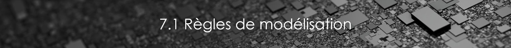

# 7. Règles et paramétrages de la maquette numérique


**Tous les éléments sont modélisés tel que construit.** C’est-à-dire que dans la mesure des informations à notre disposition, pour un complexe de façade ou pour un sol par exemple, la couche béton fera l'objet d'un "objet" sol modélisé et la couche de finition fera l'objet d'un autre "objet" sol modélisé.



Un **matériau** doit être défini pour chaque élément de la maquette. Si ce matériau est connu, il portera comme nom, la nature de l'élément auquel il est rattaché \(exemple : bois, métal, alu…\). Si ce matériau n'est pas connu, son nom sera celui du type de l'élément auquel il est affecté, exemple : pour un cadre de fenêtre dont on ne sait pas si c'est du pvc, bois,..., le matériaux s'appellera : Z\_CADRE.



Le **nom d’un élément** doit désigner de manière générique l’objet qu’il représente \(exemple : FENETRE-IMPOSTE-HAUTE_\). Ce nom doit être en majuscule avec des « \__» en remplacement des espaces et précédé du suffixe "Z\_".Ce dernier permet de différencier les éléments revit de base, des éléments que nous avons ajouté dans la maquette.

Liste des éléments concernés :

* Matériaux
* Styles de lignes
* Familles
* Hachures/motifs


Pour ce qui est de la modélisation concrète de chaque élément, se référer à la partie suivante :



