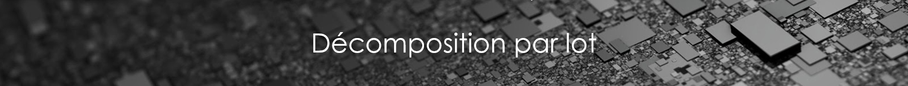

# Les Inputs

## PRÉPARER SA DOCUMENTATION

Avant d'arriver sur 







## DOCUMENTATION READY-TO-BUILD

La base documentaire transmise à [la FoncièreNumérique](http://www.lafoncierenumerique.com/) suit une organisation logique et a été correctement digitalisé \(en cas d’interrogation à ce sujet, ce reporter à la partie précédente\).

Les éléments ci-dessous liste les critères essentiels auxquels doivent répondre les éléments d'entrée utiles à la construction d'une maquette numérique d'exploitation.

### Inputs pour tous les Corps d'états

####   a. Les plans


L'ensemble des plans doivent impérativement faire l'objet d'une charte graphique uniformisés global à tous les lots \(Nommage des éléments, nommage des calques, couleurs etc…\)


Il est requis des plans répondant à minima à ces critères :

* Derniers plans **certifiés géomètre** à jour 
* Format **DWG \(Autocad 2013\) et PDF**
* Dernier indice DOE
* Découpage des plans par niveaux
* Même point d’origine **sur tous les plans \(SCU commun\)**
* Légendes indiquées sur plans \(pièces, réseaux, dimensions…\)
* Plans de repérages des détails techniques \(repérage cohérent permettant d’éviter toute hésitions ou doutes\)

####   b. Les éléments technique

* Les fiches techniques des équipements techniques
* Extractions de données GMAO
* Le CCTP d’exécution

### **Inputs pour les lots architecturaux**

* Documents graphiques **validés DOE**, **dernier indice**, niveaux par niveaux au **format DWG** ;
* Plans d’étages, coupes, élévations, plans de repérage

### **Inputs pour le lot structure**

* Documents graphiques **validés DOE, dernier indice**, niveaux par niveaux au **format DWG** ;
* Plans de repérage des réservations existantes et nouvellement crée pour les besoins du projet avec Altimétries.


Ces documents devront intégrer les épaisseurs de dalles y compris les dimensions de l’ossature structure \(Poutres IPN etc..\) , le découpage des niveaux NGF et altimétries\), les décaissés…et les modifications des épaisseurs de dalles.

Il est important de faire la distinction entrent voiles porteurs et non porteur !


### **Inputs pour les lots techniques**

####    **a. Documents Techniques**

* Le CCTP par LOT
* Fiches techniques des installations \(CTA, TGBT, et matériels\)

    **b. Documents Graphiques**

* Documents graphiques **validés DOE, dernier indice,** niveaux par niveaux au **format DWG**;
* Plans d’étages, coupes, élévations, plans de repérage


**Ces documents devront intégrer :**

* Les dimensions des installations et réseaux ;
* Les altimétrie et niveaux NGF des réseaux aéraulique et hydrauliques et chemins de câbles ;
* Dimensionnement des réseaux que ce soit aérauliques et hydrauliques pour les lots ; CVC/PLB, SSI et dimensionnement des chemins de câbles pour le Lot ELE ;
* Les dimensions \(diamètres\) et taux de pente des évacuations.
* Légende des différents réseaux \(distinction : soufflage, reprise, eau chaude, eau froide…\)


####   **c. Synoptiques des CET** 

* Lot CVC : Aéraulique et Hydraulique
* Lot PLB : Hydrauliques et Évacuation « EU/EV/EUG et EP »
* Lot SSI : Colonne Séché et Humide et DSF
* Lot SPK : Système de sécurité incendie
* Lot ELE : CFO et CFA

