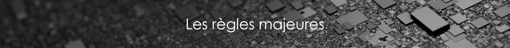

# Règles et paramétrages de la maquette numérique


  
OMNICLASS/UNIFORMAT II

Pour rappel les règles générales sont :

•         Utiliser le gabarit approprié à chaque discipline

•         Quadrillages et Niveaux : les quadrillages de la trame de composition du bâtiment et les niveaux seront basés sur ceux de la maquette référence \(Architecte\). Par défaut les niveaux définis sont des « niveaux finis » \(au-dessus des revêtements architecturaux\). - Les quadrillages sont positionnés, en général, à l’axe du mur porteur \(sauf exception\).

•         Niveaux architecture/niveaux structure : d’autres niveaux spécifiques aux disciplines peuvent être crées dans les maquettes. Chaque type de niveau doit être nommé en conséquence.

•         Respect des règles de nommage : tous les intervenants doivent respecter les règles de nommage définies dans le protocole BIM.

•         Création des paramètres : tous les nouveaux paramètres créés par les émetteurs seront des paramètres partagés dans le cas d’une extraction des données par nomenclature.

•         Vues de travail / vues de rendu : l’arborescence du projet doit obligatoirement faire la distinction entre les vues de travail et celles de livrables.

•         Position des coupes référentes : afin de pouvoir superposer en coupe les différentes maquettes, elles doivent créer des vues de coupes conformes à celles définies dans la maquette référence \(attention au nommage\)

•         Le CodeLot doit être obligatoirement renseigné par l’entreprise pour l’ensemble des objets de leur maquettes.

•         Modélisation de la maquette Revit « architecture » - maquette référente :

o   Modélisation par étage : Les éléments du bâtiment doivent être modélisés séparément pour chaque étage

o   Catégorie / famille appropriées : les éléments de la maquette doivent être créés en utilisant les outils appropriés \(outil mur, outil sol, outil poteau…\). Si ces outils ne s’avèrent pas suffisants pour modéliser un élément de la maquette, ce dernier doit être créé en utilisant d’autres techniques, telle la création de familles et dans ce cas, il faudra définir "la catégorie" de l’élément correctement. Par exemple, ne pas modéliser les éléments poteaux avec l’outil mur, etc.

o   Murs : décalages inf/sup : murs avec des contraintes de niveau sup/inf + décalage sous dalle \(non pas hauteur non-contrainte\)

o   Murs : structurels / bardages / compartimentage. Distinction importante pour la structure et l’économiste ; Attention au sous-projet, mais aussi aux couches du mur. Toujours modéliser le mur structurel à part \(pas de multicouche avec du béton\)

o   Contours dalles : limites du contour au nu intérieur du mur porteur

o   Dalles de toiture : la partie béton est considérée sol et structure \(sous-projet structure\), la partie revêtement élément de « toiture »

o   Notifications des modifications : Nuages de révision : les modifications dans les modèles doivent être annotées dans les vues de rendu avec des nuages de révision indicés avec la date de partage.

### Mettre fichier de gabarit

### 

### 1. Unité du projet

| Type | Unité | Précision | Symbole |
| :--- | :--- | :--- | :--- |
| Longueur | Mètres | 0.00 | M |
| Surface | Mètres carrés | 0.00 | M² |
| Volume | Mètres cubes | 0.00 | M³ |
| Inclinaison | Degrés décimaux | 0.00 | ° |
| Pente | Pourcentage | 0.00 | % |

### 2. Nommage de la maquette :

**NomProjet**\_**NomBat**\_**PHASE**\_**EMETTEUR**\_**TYPE**

**PHASE :** EXP

**EMETTEUR :** LFN ou autre trigramme propre à l'entreprise

| TYPE | Description |
| :--- | :--- |
| ARC | Architecture |
| CVC | Chauffage/Ventilation/Climatisation |
| PBL | Plomberie |
| STR | Structure |
| ELE | Electricité |
| SITE | Environnement |
| GHOST | Fichier conteneur DWG |
| URS | Fichier de base quadrillage/Niveau et compil des maquettes |

### 3. Matériaux


Un **matériau** doit être défini pour chaque élément de la maquette. Si ce matériau est connu, il portera comme nom, la nature de l'élément auquel il est rattaché \(exemple : bois, métal, alu…\). Si ce matériau n'est pas connu, son nom sera celui du type de l'élément auquel il est affecté, exemple : pour un cadre de fenêtre dont on ne sait pas si c'est du pvc, bois,..., le matériaux s'appellera : Z\_CADRE.


### 4. Nommage des éléments


Le **nom d’un élément** doit désigner de manière générique l’objet qu’il représente \(exemple : FENETRE-IMPOSTE-HAUTE_\). Ce nom doit être en majuscule avec des « -_» en remplacement des espaces et précédé d'un suffixe :

* A\_ : Si l'architecte est détenteur de l'élément
* S\_ : Si le BE Structure est détenteur de l'élément
* C\_ : Si il s'agit d'un élément du BE CVC
* P\_ : Si il s'agit d'un élément du BE Plomberie
* E\_ : Si il s'agit d'un élément du BE Electricité
* F\_ : Si il s'agit d'un élément du BE Charpente

Ce dernier permet de différencier les éléments revit de base, des éléments ajouté par chaque intervenant dans la maquette.

Exemple : A\_FENETRE-IMPOSTE-HAUTE

Liste des éléments concernés :

* Matériaux
* Styles de lignes
* Familles
* Hachures/motifs


### 5. Règles de modélisation


**Tous les éléments sont modélisés tel que construit.** C’est-à-dire que dans la mesure des informations à notre disposition, pour un complexe de façade ou pour un sol par exemple, la couche béton fera l'objet d'un "objet" sol modélisé et la couche de finition fera l'objet d'un autre "objet" sol modélisé.

**Par ailleurs, 
les éléments composant le bâtiment doivent être modélisés par les outils et objets adéquats.** Il ne faut pas détourner l’usage d’un outil en modélisant par exemple un poteau avec l’outil mur ou une fenêtre avec l’outil « mur rideau ».


Pour ce qui est de la modélisation concrète de chaque élément, se référer aux  partie suivantes :







































Unité de base

Purge du fichier

Nommage de la maquette

Sous-projet

