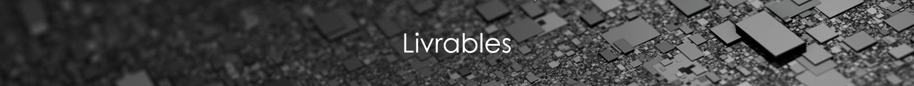

# Règles et paramétrages de la maquette numérique

### 1. Unité du projet

| Type | Unité | Précision | Symbole |
| :--- | :--- | :--- | :--- |
| Longueur | Mètres | 0.00 | M |
| Surface | Mètres carrés | 0.00 | M² |
| Volume | Mètres cubes | 0.00 | M³ |
| Inclinaison | Degrés décimaux | 0.00 | ° |
| Pente | Pourcentage | 0.00 | % |

### 2. Nommage de la maquette :

**NomProjet**\_**NomBat**\_**PHASE**\_**EMETTEUR**\_**TYPE**

**PHASE :** EXP

**EMETTEUR :** LFN ou autre trigramme propre à l'entreprise

| TYPE | Description |
| :--- | :--- |
| ARC | Architecture |
| CVC | Chauffage/Ventilation/Climatisation |
| PBL | Plomberie |
| STR | Structure |
| ELE | Electricité |
| SITE | Environnement |
| GHOST | Fichier conteneur DWG |
| URS | Fichier de base quadrillage/Niveau et compil des maquettes |

### 3. Matériaux


Un **matériau** doit être défini pour chaque élément de la maquette. Si ce matériau est connu, il portera comme nom, la nature de l'élément auquel il est rattaché \(exemple : bois, métal, alu…\). Si ce matériau n'est pas connu, son nom sera celui du type de l'élément auquel il est affecté, exemple : pour un cadre de fenêtre dont on ne sait pas si c'est du pvc, bois,..., le matériaux s'appellera : Z\_CADRE.


### 4. Nommage des éléments


Le **nom d’un élément** doit désigner de manière générique l’objet qu’il représente \(exemple : FENETRE-IMPOSTE-HAUTE_\). Ce nom doit être en majuscule avec des « \__» en remplacement des espaces et précédé du suffixe "Z\_".Ce dernier permet de différencier les éléments revit de base, des éléments que nous avons ajouté dans la maquette.

Liste des éléments concernés :

* Matériaux
* Styles de lignes
* Familles
* Hachures/motifs


### 5. Règles de modélisation


**Tous les éléments sont modélisés tel que construit.** C’est-à-dire que dans la mesure des informations à notre disposition, pour un complexe de façade ou pour un sol par exemple, la couche béton fera l'objet d'un "objet" sol modélisé et la couche de finition fera l'objet d'un autre "objet" sol modélisé.

**Par ailleurs, 
les éléments composant le bâtiment doivent être modélisés par les outils et objets adéquats.** Il ne faut pas détourner l’usage d’un outil en modélisant par exemple un poteau avec l’outil mur ou une fenêtre avec l’outil « mur rideau ».


Pour ce qui est de la modélisation concrète de chaque élément, se référer aux  partie suivantes :







































Unité de base

Purge du fichier

Nommage de la maquette

Sous-projet

### 6. Procédure de remise des maquettes

De manière général, chaque maquette déposée sur la plateforme doit être conforme aux différents points présents dans la partie [**Audit et visa BIM**](https://bim-lafoncierenumerique.gitbook.io/project/exploitation-digitale-run-1/audit-et-visa-bim).

Les points suivants feront l’objet d’un examen en priorité. Leur non-respect pourrait entraîner une non validation de réception de la part du BIM Manager :

