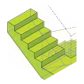

# Escaliers







* Les escaliers sont modélisés en tant qu’escalier et non comme une succession de portions de dalles positionnées à des hauteurs différentes
* La modification par esquisse de la géométrie de l’escalier doit être utilisée avec précaution, aucun recours ne sera possible.



"NATURE"\_"_INTouEXT"\__"DIM"

Exemple : pour une fenetre oscillo-battante de 1,8mx1,10m :

OSCILLO-BATTANTE\_INT\_l1,8xH1,2



