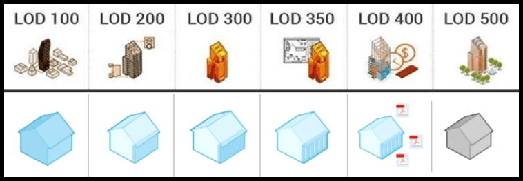

# Les niveaux de détails


La modélisation des maquettes numérique est régie par le Niveau de Développement \(ND\), appelés LOD en Anglais \(Levels Of Development\) \(AIAG202-2013 Building Information Modeling Protocol Form1 and is organized by CSI Uniformat\).

**LOD 100 :** Les éléments du modèle peuvent être représenté par un _**symbole ou de manière générique**_. Les informations contenues dans les éléments peuvent provenir d'autres éléments.

**LOD 200 :** Les éléments du modèle sont représentés graphiquement d'une manière générique en tant qu'objet ou assemblage. _**Les dimensions, quantités, formes, positions et orientations des éléments peuvent être approximatives.**_

**LOD 300 :** Les éléments du modèle sont représentés graphiquement d'une manière spécifique en tant qu'objet ou assemblage. _**Les dimensions, quantités, formes, positions et orientations sont spécifiques aux éléments.**_

**LOD 350 :** Les éléments du modèle sont représentés graphiquement d'une manière spécifique en tant qu'objet ou assemblage. Les dimensions, quantités, formes, positions et orientations sont _**spécifiques aux éléments. Les éléments interagissent avec les autres éléments**_.

**LOD 400 :** idem LOD 350 mais avec en plus les informations sur le détail, la fabrication, l'assemblage et l'installation sont contenues dans les éléments.

**LOD 500 :** idem LOD 400 mais tel que contruit et vérifié sur place.

Le Level Of Development peut être décomposé du niveau de détail géométrique des éléments \(Level Of Geometry\) et le niveau d’information \(Level Of Information\) associé aux différents éléments géométriques et volumes d’espaces / pièces / locaux composant la maquette numérique. 



<table>
  <thead>
    <tr>
      <th style="text-align:left">LOG 100</th>
      <th style="text-align:left">LOI 100</th>
    </tr>
  </thead>
  <tbody>
    <tr>
      <td style="text-align:left">
        

        <ul>
          <li>Mod&#xE8;les de b&#xE2;timents basiques avec dimensions, formes et orientations
            approximatives.</li>
        </ul>
        

        <ul>
          <li>&#xC9;tages ou espaces consid&#xE9;r&#xE9;s comme des corps volumiques.</li>
        </ul>
      </td>
      <td style="text-align:left">
        

        <ul>
          <li>Objets d&#xE9;crits &#xE0; l&#x2019;aide d&#x2019;attributs de base (type
            ou nom de l&#x2019;espace p. ex.) pour pouvoir repr&#xE9;senter le programme
            des espaces.</li>
        </ul>
      </td>
    </tr>
  </tbody>
</table>



<table>
  <thead>
    <tr>
      <th style="text-align:left">LOG 200</th>
      <th style="text-align:left">LOI 200</th>
    </tr>
  </thead>
  <tbody>
    <tr>
      <td style="text-align:left">
        

        <ul>
          <li>Mod&#xE8;le compos&#xE9; d&apos;&#xE9;l&#xE9;ments &#xE0; l&#x2019;appellation
            claire et pr&#xE9;sentant un niveau de d&#xE9;tail graphique, une forme
            et une orientation bien d&#xE9;finis.</li>
        </ul>
        

        <ul>
          <li>Pr&#xE9;-d&#xE9;finition des syst&#xE8;mes et &#xE9;l&#xE9;ments de construction
            essentiels (fa&#xE7;ades, murs, portes, plafonds, mais aussi espaces, ouvrage
            porteur et corps volumiques de l&#x2019;&#xE9;quipement du b&#xE2;timent)
            permettant de d&#xE9;duire des valeurs de r&#xE9;f&#xE9;rence.</li>
        </ul>
        

        <ul>
          <li>Tous les modules et composants principaux, les am&#xE9;nagements horizontaux
            et verticaux et les installations techniques sont model&#xE9;s.</li>
        </ul>
      </td>
      <td style="text-align:left">
        

        <ul>
          <li>Mod&#xE8;le compl&#xE9;t&#xE9; par d&#x2019;autres attributs que le nom
            et le type d&#x2019;objet: distinction porteur/non porteur, int&#xE9;rieur/
            ext&#xE9;rieur, autres informations non mod&#xE9;lis&#xE9;es si n&#xE9;cessaire.</li>
        </ul>
        

        <ul>
          <li>Renseignements destin&#xE9;s &#xE0; l&#x2019;&#xE9;valuation des co&#xFB;ts.</li>
        </ul>
      </td>
    </tr>
  </tbody>
</table>



<table>
  <thead>
    <tr>
      <th style="text-align:left">LOG 300</th>
      <th style="text-align:left">LOI 300</th>
    </tr>
  </thead>
  <tbody>
    <tr>
      <td style="text-align:left">
        <ul>
          <li>Le mod&#xE8;le contient des &#xE9;l&#xE9;ments de construction suffisamment
            d&#xE9;taill&#xE9;s pour la coordination, l&#x2019;attribution aux corps
            de m&#xE9;tier, ainsi que la d&#xE9;duction des valeurs cl&#xE9;s.</li>
        </ul>
        

        <ul>
          <li>El&#xE9;ments de construction repr&#xE9;sent&#xE9;s sous forme de structures
            stratifi&#xE9;es, &#xE9;ventuellement &#xE0; l&#x2019;aide de graphismes
            typiques du m&#xE9;tier.</li>
        </ul>
        

        <ul>
          <li>Composants de l&#x2019;&#xE9;quipement du b&#xE2;timent s&#xE9;par&#xE9;s
            selon les corps de m&#xE9;tiers</li>
        </ul>
      </td>
      <td style="text-align:left">
        <ul>
          <li>Attribution des objets bas&#xE9;e sur les informations relatives aux objets
            consign&#xE9;es dans le mod&#xE8;le de donn&#xE9;es, p. ex. une description
            des informations produits n&#x2019;&#xE9;manant pas du fabricant.</li>
        </ul>
        

        <ul>
          <li>Renseignements compl&#xE9;mentaires sur les normes et certifications par
            des participants externes au projet (experts, sp&#xE9;cialistes agr&#xE9;&#xE9;s,
            etc.).</li>
        </ul>
        

        <ul>
          <li>Existence d&#x2019;informations relatives aux unit&#xE9;s de livraison/
            d&#x2019;emballage, dimensions et autres exigences telles que les mat&#xE9;riaux
            ou les propri&#xE9;t&#xE9;s.</li>
        </ul>
      </td>
    </tr>
  </tbody>
</table>



<table>
  <thead>
    <tr>
      <th style="text-align:left">LOG 400</th>
      <th style="text-align:left">LOI 400</th>
    </tr>
  </thead>
  <tbody>
    <tr>
      <td style="text-align:left">
        <ul>
          <li>Le mod&#xE8;le contient les diff&#xE9;rentes parties de l&#x2019;ouvrage,
            suffisamment d&#xE9;taill&#xE9;es pour la planification de la fabrication
            et du montage, ainsi que pour la d&#xE9;duction des valeurs cl&#xE9;s.</li>
        </ul>
        

        <ul>
          <li>Parties d&#x2019;ouvrage graphiques d&#xE9;finitives tenant compte de
            l&#x2019;espace effectivement disponible, pour int&#xE9;gration sur le
            lieu pr&#xE9;vu.</li>
        </ul>
      </td>
      <td style="text-align:left">
        <ul>
          <li>Attribution d&#x2019;objets: Description de toutes les exigences avec
            informations produits sp&#xE9;cifiques donn&#xE9;es par le fabricant.</li>
        </ul>
        

        <ul>
          <li>Pr&#xE9;cision d&#x2019;autres attributs destin&#xE9;s &#xE0; la mise
            &#xE0; jour du descriptif d&#xE9;taill&#xE9;, au calcul des co&#xFB;ts
            et, &#xE9;ventuellement, &#xE0; des calculs compl&#xE9;mentaires concernant
            les besoins en personnel, mat&#xE9;riaux, &#xE9;quipements et &#xE9;nergie.</li>
        </ul>
      </td>
    </tr>
  </tbody>
</table>



<table>
  <thead>
    <tr>
      <th style="text-align:left">LOG 500</th>
      <th style="text-align:left">LOI 500</th>
    </tr>
  </thead>
  <tbody>
    <tr>
      <td style="text-align:left">
        <ul>
          <li>Mod&#xE8;le comportant toutes les parties d&#x2019;ouvrage &#xAB;as built&#xBB;.</li>
        </ul>
        

        <ul>
          <li>Mod&#xE8;le soumis &#xE0; un contr&#xF4;le de qualit&#xE9; au moins al&#xE9;atoire,
            ou compar&#xE9; &#xE0; l&#x2019;&#xE9;tat actuel du b&#xE2;timent.</li>
        </ul>
        

        <ul>
          <li>Forme des parties d&#x2019;ouvrage pouvant &#xEA;tre repr&#xE9;sent&#xE9;e
            de fa&#xE7;on peu pr&#xE9;cise, mais &#xE0; l&#x2019;emplacement auquel
            ces derni&#xE8;res sont effectivement pos&#xE9;es; d&#xE9;nomination coh&#xE9;rente
            unique et conforme &#xE0; ce qui a &#xE9;t&#xE9; convenu pour permettre
            une utilisation ult&#xE9;rieure.</li>
        </ul>
        

        <ul>
          <li>Pr&#xE9;paration de tous les &#xE9;l&#xE9;ments de construction pr&#xE9;vus
            pour le transfert vers un syst&#xE8;me CAFM. Ceux-ci peuvent &#xEA;tre
            sp&#xE9;cifiquement utilis&#xE9;s pour les fonctions de recherche: ils
            contiennent toutes les informations g&#xE9;om&#xE9;triques n&#xE9;cessaires
            (rayons de pivotement, intervalle minimum entre deux op&#xE9;rations de
            maintenance, etc.) r&#xE9;pondant aux exigences du Facility Management
            / FM).</li>
        </ul>
      </td>
      <td style="text-align:left">
        <ul>
          <li>Attribution des objets finalis&#xE9;e: toutes les informations n&#xE9;cessaires
            relatives aux objets et concernant les produits effectivement install&#xE9;s
            sont disponibles et comportent tous les renseignements relatifs au fabricant,
            tels que ses coordonn&#xE9;es, le num&#xE9;ro de mod&#xE8;le, la r&#xE9;f&#xE9;rence
            de l&#x2019;article ou de l&#x2019;unit&#xE9;, la garantie et le garant,
            la p&#xE9;riode de garantie (&#xE9;l&#xE9;ments), la dur&#xE9;e en ann&#xE9;es,
            le num&#xE9;ro de s&#xE9;rie, la date d&#x2019;installation ou tout autre
            point similaire, de m&#xEA;me que les informations produits sp&#xE9;cifiques
            au fabricant.</li>
        </ul>
        

        <ul>
          <li>Descriptif d&#xE9;taill&#xE9; &#xE0; jour, pouvant &#xEA;tre utilis&#xE9;
            dans le cadre de la maintenance et &#xE0; d&#x2019;autres fins lors de
            la phase d&#x2019;exploitation.</li>
        </ul>
      </td>
    </tr>
  </tbody>
</table>



