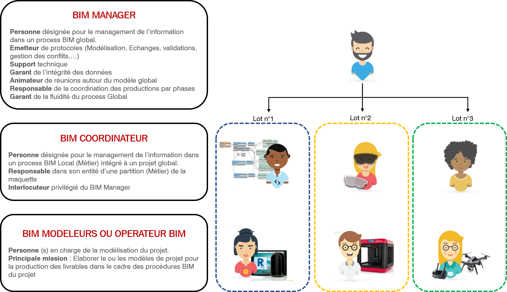

# Les acteurs BIM

### Missions du BIM Manager

Le BIM manager de la MOE a été désigné afin de garantir l’atteinte des objectifs BIM fixés pour le projet et stipulé dans le présent cahier des charges BIM. Foundation a pour missions de coordonner l’élaboration de la Maquette Numérique du Projet. Son rôle est donc d’organiser le process BIM des entreprises pendant la phase d’exécution jusqu’à la livraison de la maquette DOE numérique et de faire respecter la méthodologie BIM définie en amont du projet à travers les documents de référence \(dont le protocole BIM\). Il veille à la cohérence des maquettes numériques et à la structuration des données qui y sont intégrées.

* Établissement du protocole BIM ;
* Conseiller les titulaires dans la mise en œuvre du protocole ;
* Fournir aux titulaires les maquettes de géoréférencement et les fichiers de paramètres partagés ;
* Veiller à la qualité des informations du modèle et au respect du protocole et de ses orientations ;
* Informer les coordinateurs BIM des évolutions du process BIM et des procédures ;
* Réflexion et tests sur l’amélioration des procédures et la résolution de problèmes ;
* Contrôler le niveau de détail convenu des informations dans le modèle proprement dit pour chaque phase du processus ;
* Assurer une veille technologique concernant le BIM ;
* Gestion des outils utilisés \(version Revit, plugins, outils complémentaires\) ;
* S’informer auprès des BIM coordinateurs des problèmes rencontrés ;
* Agir en retour sur les problématiques rencontrées ou les commenter, en interne avec les collaborateurs et en externe avec les entreprises et la MOE ;
* Points avec les coordinateurs BIM et BIM Modeleurs, définition des interfaces et édition des comptes rendus ;
* Participer à des séances de coordination BIM \(contrôle du projet et du BIM\) ;
* Participer au Comité de pilotage des différents acteurs du projet ;
* Gérer les listes des livrables issus de la maquette numérique ;
* Valider avec le chef de projet les dates de rendus intermédiaires et rendus de fin de phase ;
* Réceptionner et vérifier la conformité, au protocole, des maquettes numériques fournies par les titulaires afin de les mettre à disposition de l’équipe de maîtrise d’œuvre, de la cellule de synthèse et in fine de la maitrise d’ouvrage dans le cadre de la maquette DOE ;

Le BIM Manager est ainsi chargé d'organiser les flux, la maîtrise d’œuvre et chaque titulaire restant responsable de ses maquettes numériques.

### Responsabilités du BIM Manager

Le BIM Manager n’est pas responsable du contenu des maquettes, car il n’est pas à l’origine de leur production qui est assurée par les coordinateurs BIM et les BIM Modeleurs de chaque intervenant.

En revanche, le BIM manager doit garantir la concordance des maquettes remises à l’APHP au regard du protocole BIM d’exécution. Si cette garantie venait à être remise en cause par la faute d’un membre de l’équipe BIM du groupement des entreprises, Foundation devra alors expliciter les actions correctives à mener et alerter la Maîtrise d’ouvrage de la divergence constatée.

### Missions du Coordinateur BIM

Chaque intervenant de la maquette numérique présentera au BIM Manager, avant le démarrage du projet, un référent BIM qui doit connaître l’utilisation des outils liés au process BIM. Ces référents auront pour rôle de transmettre les méthodologies décrites dans le futur protocole BIM d’exécution à leurs équipes d’études et mettre en place l’organisation interne à leur équipe pour produire les livrables BIM adaptés à chaque phase.

Chaque Coordinateur/référent BIM est responsable de la production de maquette de la société qu’il représente, pour l’ensemble des disciplines/lots contractés. Il devra mettre en œuvre les moyens décrits par le BIM manager et appliquer les actions correctives adéquates en cas de besoin.

Chaque référent BIM est responsable de la maquette numérique de son lot, de sa mise à jour et de son contrôle. À chaque dépôt de maquette sur la plateforme collaborative, BIM le référent BIM devra : 

* Transmettre un descriptif précis de l’avancement de sa/ses maquette\(s\) numérique\(s\) au BIM Manager pour information,
* Transmettre la liste des livrables modifiés et de leurs indices, issus de cette maquette.
* Vérifier l’intégration, dans la maquette numérique de sa discipline ou de son lot, des remarques effectuées par la direction de projet ainsi que par la direction de synthèse ;

Plus globalement le référent BIM est chargé des missions suivantes :

* Assister le BIM Manager dans la création du Manuel Projet ;
* Créer le\(s\) modèle\(s\) de la discipline à partir des gabarits de l’entreprise ;
* Créer les sous projets en vue du travail collaboratif ;
* Mettre en place le modèle « quadrillage et niveau » pour sa discipline conformément au fichier de coordination \(URS\) mis en place par le BIM Manager ;
* Contrôler les « bonnes pratiques quotidiennes » des utilisateurs ;
* Assurer la viabilité et l’intégrité des modèles et assiste la production dans le maintien du niveau 0 erreur dans le\(s\) modèle\(s\) ;
* Valider les familles créées par la production avant intégration au projet ;
* Mettre à jour de la bibliothèque d’objets générale de son entreprise ;
* Assister aux réunions concernant le BIM Management tous corps d’état ;
* Gérer les liens entre son modèle et celui des autres disciplines/lots ;
* Transférer les données tirées de son modèle vers d’autres partenaires de projet ;

### Responsabilités du Coordinateur BIM

Chaque Coordinateur BIM est responsable de la production de maquette de la société qu’il représente, pour l’ensemble des disciplines/lots contractés. Il doit mettre en œuvre les moyens décrits par le BIM manager et appliquer les actions correctives adéquates en cas de besoin.

Par ailleurs, chaque Coordinateur BIM est responsable de la concordance entre le contenu de la maquette et les plans diffusés extraits de cette même maquette pendant toute le phase exécution.

### Missions du BIM Modeleur

Les Modeleurs BIM, ou producteurs BIM sont internes à chaque entreprise, et communiquent par l’intermédiaire de leur coordinateur/référent BIM. Les modeleurs BIM sont à l’origine des maquettes et les alimentent tout au long du projet, que ce soit en termes de modélisation géométrique ou de renseignement des données.

* Organise et contrôle le travail de conception du modèle de sa discipline ;
* Assure le suivi de ses rendus en s'appuyant sur la liste de livrables ;
* Crée des familles et s'assure du bon niveau de détail selon la phase de production du projet ;
* Maitrise du ratio homme/temps de la production du modèle ;
* Assiste aux différentes réunions de conception et du BIM Management tous corps d’état ;
* Met en page et renseigne les feuilles de rendu ;

### Schéma de synthèse

