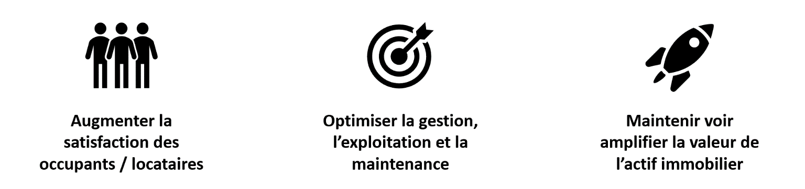

# Objectifs et cas d'usages en BIM exploitation

### 1. Objectifs

Trois principaux objectifs guident la digitalisation du secteur de l’immobilier :

### 2. Enjeux

L’avatar numérique devient progressivement un centre gravitationnel des données et des acteurs de l’immobilier. Ainsi, trois principaux enjeux se dégagent :

TABLEAU CONSTANCE



















