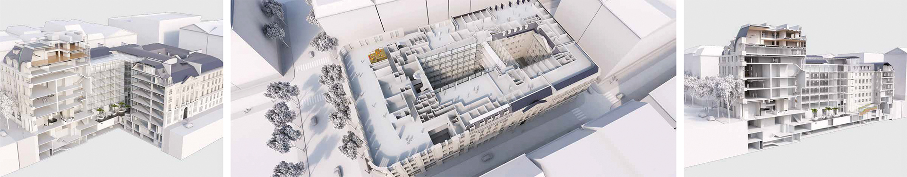

# 1. Généralités


Le présent cahier des charges BIM a pour objectif de permettre aux entreprises de prendre part à un projet BIM exploitation en intégrant les spécificités attendues dans la démarche BIM de la foncière numérique. Dans ce cadre, il décrit à la fois l’ambition, les rôles des intervenants, les responsabilités, les tâches et les grands processus inhérents à l’utilisation du BIM. Il fournit également un support permettant au travers du Protocole BIM d'exploitation qui sera rédigée par le BIM Manager, d’établir une méthodologie claire permettant aux entités concernées de hiérarchiser les priorités et optimiser les ressources en fonction des objectifs BIM à atteindre.

En phase consultation et exécution le présent cahier des charges BIM servira en particulier :

* A assurer la compréhension des implications relatives au BIM tout au long du projet,
* A guider le BIM Manager du projet \(intégré à la MOE\) dans la rédaction des documents contractuels et de travail et du protocole BIM d’exécution.
* A informer les entreprises des objectifs BIM à atteindre. A permettre au Bureau de Contrôle, Coordinateur SPS et Economiste et tous les autres intervenants d’appréhender les moyens dont ils disposent afin de bénéficier de la mise-en-place du processus BIM sur le projet.

Le contenu du document pourra être amendé par des clauses particulières relatives au projet sous réserve de l’accord formel du Maître de l’Ouvrage.

Le protocole BIM d’exploitation viendra amender, en cas de besoin, les éléments décrit dans le présent cahier des charges. Ceci afin de conserver une adéquation entre les objectifs BIM, le planning et les nécessités de l’opération.

Se reporter au projet qui vous concerne dans la section suivante :

###  1.3.1 BIM Manager

[**La Foncière numérique**](http://www.lafoncierenumerique.com/) dispose au sein de son groupe une entité spécialisé BIM du nom de [**Foundation-bnd**](https://www.foundation-bnd.com/).

Située au 28 Cours Albert 1er à Paris \(75008\), cette dernière assurera la mission de BIM Management des opérations ainsi que la gestion de la plateforme collaborative mise en place sur ses projets. 

Pour toutes questions éventuelles sur ce sujet, N'hésitez pas à contacter :

**Nicolas BOUTET**, Directeur associé, [n.boutet@foundation-bnd.com](mailto:n.boutet@foundation-bnd.com)                                                                                

**Matthias MONTI**, BIM Manager, [m.monti@foundation-bnd.com](mailto:m.monti@foundation-bnd.com)

